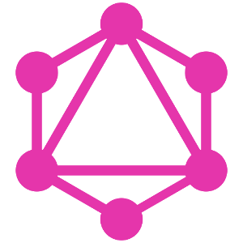

@title[Introduction]
## GraphQL for the inquiring

#### An introduction to your new query language

---
@title[About me]
## whoami
**Basile Pesin**, Computer Science Student at Sorbonne Université (Paris), and GitHub Campus Expert

@fa[github] [https://github.com/Vertmo](https://github.com/Vertmo)

@fa[twitter] [https://twitter.com/Vertmo](https://twitter.com/Vertmo)

---
@title[What is it ?]
## What is GraphQL ?
Querying language developped by Facebook since 2012 and published in 2015. Alternative to REST APIs.

---
@title[REST]
## The old way : REST
* Query different endpoints : `/users/<username>` to get ALL the information about ONE user, `/users/<username>/repos` to get ALL the repositories of ONE user
* Get JSON string back
* No typing or validation whatsoever

---
@title[GraphQL]
## The new way : GraphQL
* Like REST, GraphQL is structured
* In GraphQL, you query a single endpoint, and you get precisely what you ask for 
* Response are JSON strings, and query are too !
* Strongly typed

---
@title[Usage]
## Who uses GraphQL ?
* Facebook (obviously...)
* GitHub (first public API)
* Pinterest, Yelp, Twitter, The New York Times ...
* Lots of French companies

---
@title[Query]
## My first Query ...
```
query {
  user(login:"vertmo") {
    name
    isCampusExpert
  }
}
```

---
@title[Query response]
## ... and its response
```
{
  "data": {
    "user": {
      "name": "Basile Pesin",
      "isCampusExpert": true
    }
  }
}
```

---
@title[Mutation]
## Changing data ...
```
mutation {
  addReaction(input: {
    subjectId:"MDU6SXNzdWUyMTg2NjA4OTQ=", 
        content:THUMBS\_UP
    }) {
    reaction {
      id
      content
    }
  }
}
```

---
@title[Mutation response]
## ... also yields a response
```
{
  "data": {
    "addReaction": {
      "reaction": {
        "id": "MDg6UmVhY3Rpb24yMTA0MDU5Mw==",
        "content": "THUMBS_UP"
      }
    }
  }
}
```

---
@title[Aliases]
## Aliases
```
query {
  firstUser: user(login:"vertmo") {
    name
  }
  secondUser: user(login:"joenash") {
    name
  }
}
```

---
@title[Fragments]
## Fragments = Macros
```
query {
  firstUser: user(login:"vertmo") {
    ...userFragment
  }
  secondUser: user(login:"joenash") {
    ...userFragment
  }
}

fragment userFragment on User{
  name
  isCampusExpert
}
```

---
@title[GraphQL Explorer]
## Try the GitHub API Explorer !
[https://developer.github.com/v4/explorer/](https://developer.github.com/v4/explorer/)

---
@title[GraphiQL]
## GraphiQL


---
@title[App]
## Let's build our App !
It's a simple three-tiers architecture


---
@title[Client]
## Querying from client
Multiple client libs in Javascript, Java, Python...

Can go from a simple `fetch` wrapper to a full framework (Relay)

---
@title[Server]
## Building a Server API
Multiple languages and server libraries : Node.js, Java, Python, Clojure, Go, ...

We'll focus on Node.js

---
@title[Entry Point]
## Using the express framework
```javascript
var app = express()

app.use('/graphql', graphqlHTTP({
  schema: schema,
  rootValue: root,
  graphiql: true,
}))

app.listen(4000, () => console.log('GraphQL server running'))
```

---
@title[Schema]
## GraphQL schema syntax
```javascript
var schema = buildSchema(`
    type Query {...}
    type Mutation {...}
    ...
`)
```

---
@title[Types]
## Types
* Scalar types : Int, Float, String, Boolean, ID. You can define a new scalar
* Lists : []
* Enum types : `enum Day {MONDAY TUESDAY WEDNESDAY}`
* Object types : user-defined (query and mutation are also object types)

---
@title[User]
## User type
```
"A User of the app"
type User {
    id: ID
    username: String
    name: String
    surname: String
    fullname: String
    role: Role
},
```

---
@title[User Query]
## User Query
```
type Query {
    "A single user by it's id"
    user(id: ID!): User
}
```

---
@title[Resolvers]
## Resolvers
But where do the results come from ?

Asynchronous resolver functions

---
@title[Root resolver]
## Root resolver (using Sequelize)
```javascript
var root = {
    user: (args) => UserDB.findById(args.id)
        .then(user => new User(user))
}
```

---
@title[User class]
## User class (and it's internal resolvers)
```javascript
class User {
    constructor(data) {
        this.id = data.id
        this.username = data.username
        this.name = data.name
        this.surname = data.surname
        this.roleID = data.roleId
    }

    fullname() { return this.surname + this.name }

    role() { return ... }
}
```

---
@title[Mutation]
## User mutation
In the schema
```
type Mutation {
    "Create a user"
    newUser(username: String!, password: String!, name: String,
        surname: String, role: RoleInput!): User
}
```
In the resolvers
```javascript
newUser: (args) => RoleDB.findOne({where: {name: args.role.name}})
    .then(r => UserDB.findOrCreate({
        where:{username:args.username}, 
        defaults:{username:args.username, password:args.password,
            name:args.name, surname:args.surname, roleId:r.id}
}).then(data => new User(data[0])))
```

---
@title[Input type]
## RoleInput is an input type
Role :
```
type Role {
    id: ID,
    name: String
}
```
RoleInput :
```
input RoleInput {
    name: String!
}
```

---
@title[Resources]
## Resources
* [http://graphql.org/](http://graphql.org/)
* [https://developer.github.com/v4/](https://developer.github.com/v4/)
